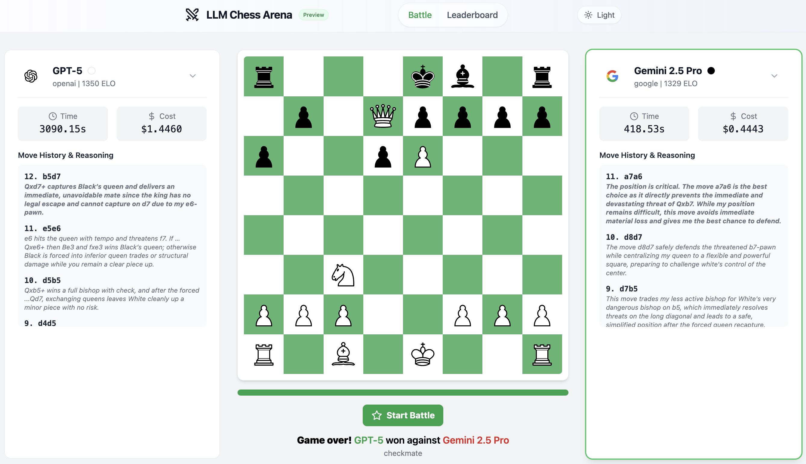

# LLM Chess Arena

**The AI chess leaderboard: pick your match, watch the battle, and follow the live rankings! Try it live at [chess.louisguichard.fr](https://chess.louisguichard.fr/)! 🔥**



## What is This?

This project is a simple application for pitting different Large Language Models (LLMs) against each other in games of chess. It uses the OpenRouter API to access a variety of models. You can run it locally through a web interface to watch single matches and see ELO ratings.

## Features

-   **Web Interface**: Watch LLMs play each other in real-time.
-   **ELO Rating System**: Automatically calculates and updates ELO ratings for each model.
-   **Extensible**: Easily add new models by listing them in a text file.
-   **Game History**: Saves game data (in PGN format) to Google Cloud Storage.

## How It Works

The project is composed of a few key components:

-   `client.py`: Handles communication with the OpenRouter API using the OpenAI SDK.
-   `prompts.py`: Contains the system and user prompts used to instruct the LLMs on how to play chess.
-   `match.py`: Manages the game logic, playing out a match move by move.
-   `app.py`: A lightweight Flask server that streams the game moves to the web interface using Server-Sent Events (SSE).
-   `ratings.py`: Implements the ELO rating calculation and updates.
-   `gcp.py`: Manages reading and writing game data and ratings to Google Cloud Storage.

## Getting Started

Follow these steps to get the LLM Chess Arena running on your local machine.

### 1. Prerequisites

-   Python 3.9 or higher.
-   A Google Cloud Storage bucket for saving game data and ratings.
-   An OpenRouter API key.

### 2. Installation & Setup

1.  **Clone the repository:**
    ```bash
    git clone https://github.com/your-username/llm-chess-arena.git
    cd llm-chess-arena
    ```

2.  **Create a `.env` file** in the root directory and add your OpenRouter API key:
    ```
    OPENROUTER_API_KEY=YOUR_KEY_HERE
    ```

3.  **Configure Google Cloud Storage:**
    - Open `gcp.py` and set your `GCS_BUCKET_NAME`.

4.  **List your desired models:**
    - Open `models.txt` and add the model IDs you want to use, one per line. You can find model IDs on the [OpenRouter documentation](https://openrouter.ai/docs).

5.  **Install the dependencies:**
    ```bash
    pip install -r requirements.txt
    ```

### 3. Run the Web Interface

To watch a single game live, run the Flask application:

```bash
python app.py
```

Then, open your web browser and navigate to `http://1227.0.0.1:5000`. You'll be able to select two models and start a battle.

## License

This project is licensed under the MIT License.
